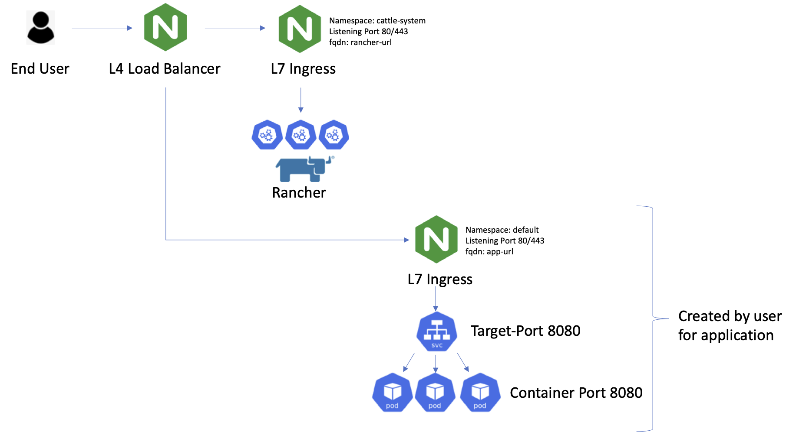

# Simple Node API

Simple NodeJS API test

## Local Node Testing

Complete the following steps to start a new project (NEW-PROJECT-NAME):

1. Clone this repository to your local machine `git clone SIMPLE_NODE_APP_URL NEW-PROJECTS-NAME`
2. `cd` into the cloned repository
3. Make a fresh start of the git history for this project with `rm -rf .git && git init`
4. Install the node dependencies `npm install`
5. Move the example Environment file to `.env` that will be ignored by git and read by the express server `mv example.env .env` (optional)

## Node Scripts

Start the application `npm run start`

Start nodemon for the application `npm run dev`

Run the tests `npm test`

## Deploying In Rancher

To deploy using Rancher UI
1. In Rancher UI select cluster and namespace for deployment
2. Select **Resources** > **Workloads**
3. Click **Deploy**
4. Enter the following for deployment
    - Name: mock-api
    - Docker Image: jasoria/mock-node-api:v1
    - Namespace: ```namespace where to deploy```
    - Port Mapping > Add Port > Port Name: TCP, Publish the Container port: 8080, Protocol: TCP, As a ClusterIP
5. Select **Launch**. This will create the application deployment and service
6. Select **Load Balancing** and click **Add Ingress**
8. Enter the following:
    - Name: mock-api-ingress
    - Namespace: ```namespace where app is deployed```
    - Select Specify a host to use: ```your fqdn```
    - Target Backend > Add Service > Path: /, Target: mock-api server, Port: 8080
    - SSL/TLS Certificate > Add Certificate > Use default ingress controller certificate > Host: ```your fqdn```
9. Select **Save**
10. Once the ingress is created test the app using the following ```curl``` commands:
    - curl http://```your fqdn``` # Expected 308 Permanent Redirect
    - curl https://```your fqdn``` -k # Expected Hello World!
    - curl https://```your fqdn/api/data``` -k # Expected JSON Response
    - curl https://```your fqdn>/api/data/comments``` -k # Expected JSON Response

<br>

## Deploying With Kubectl

***NOTE***: you will need to ensure you have an ingress controller deployed in your enviroment prior to using the ```mock-node-api-ingress``` manifest.

See [NGINX Ingress Controller](https://kubernetes.github.io/ingress-nginx/deploy/) for more information on how to deploy Kubernetes ingress controller.

```
kubectl apply -f mock-node-api-deployment.yaml
kubectl apply -f mock-node-api-svc.yaml
kubectl apply -f mock-node-api-ingress.yaml
```

## Architecture Diagram


## Contributor(s)

Javier Soria